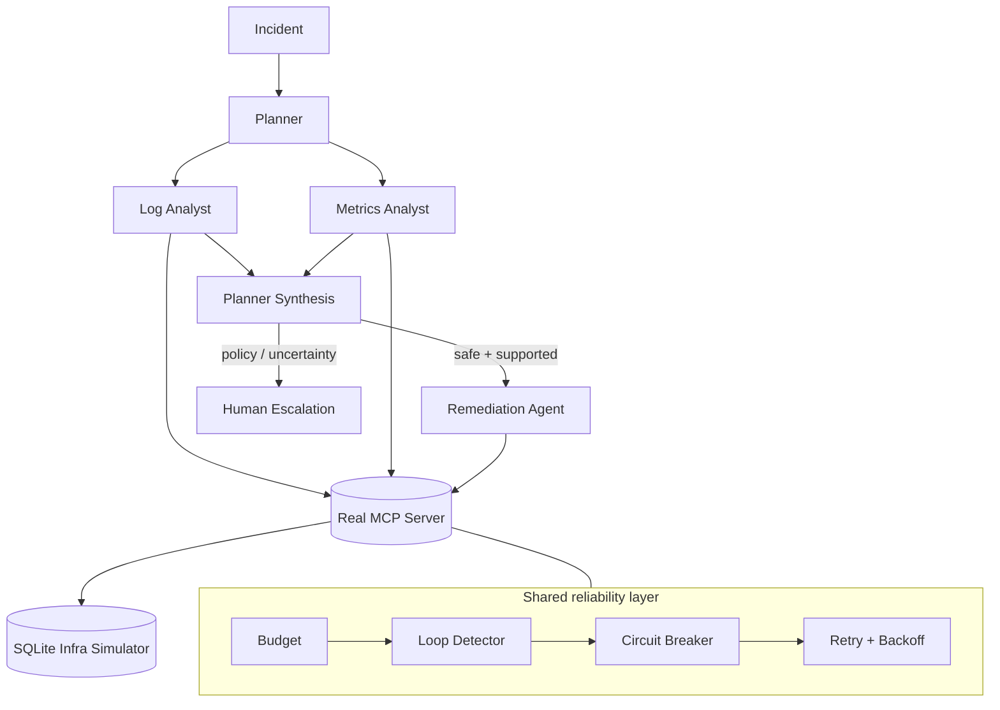

# DevOps Triage Agent

> Reliability-first multi-agent incident triage over a real MCP tool protocol.

A portfolio-grade DevOps incident triage system built around a planner, specialist agents, bounded remediation, and a reliability layer that sits between every agent and every tool call.

[](https://github.com/Rollins1989/devops-triage-agent)
[](https://www.python.org/)
[](https://modelcontextprotocol.io/)

## What this demonstrates

This project focuses on the engineering details that are easy to skip in an agent demo:

- **Real MCP server** — tools are exposed through the MCP stdio protocol, not a mocked dispatcher.
- **Least-privilege agents** — each agent has an explicit tool allow-list enforced in code.
- **Reliability controls** — retries with exponential backoff and jitter, per-tool circuit breakers, loop detection, and shared run budgets.
- **Conservative remediation** — at most one bounded remediation attempt before escalation.
- **Dry-run by default** — destructive/simulated remediation is disabled unless explicitly confirmed.
- **Structured tracing** — every important decision, handoff, tool call, retry, and guardrail event is written to JSONL.
- **Offline execution** — the entire system works without an Anthropic API key through deterministic playbooks.

## Architecture



### Control flow

1. **Plan** — identify the affected service and incident priority.
2. **Investigate** — Log Analyst and Metrics Analyst run concurrently against the same MCP client.
3. **Synthesize** — combine findings and apply explicit escalation policy.
4. **Remediate** — perform one category-specific action when policy allows it.
5. **Escalate** — create an incident ticket when confidence is low, signals disagree, reliability guards trip, or policy requires human review.

## Built-in scenarios

| Scenario | Simulated fault | Expected behavior |
| --- | --- | --- |
| `crashloop` | OOM / CrashLoopBackOff | Diagnose and optionally restart the service |
| `latency` | Bad canary deployment | Diagnose and optionally roll back |
| `db` | Connection-pool exhaustion | Escalate instead of auto-remediating |

## Quick start

### 1. Install

Requires Python 3.10+.

```bash
python3 -m venv .venv
source .venv/bin/activate
python -m pip install -e ".[dev]"
```

### 2. Run the safe default

```bash
python -m main --scenario crashloop
```

This runs the complete planner → specialists → synthesis → remediation flow, but remediation stays in **dry-run mode**.

### 3. Execute a simulated remediation

```bash
python -m main --scenario crashloop --confirm-actions
```

### 4. Exercise the reliability layer

```bash
python -m main --scenario crashloop --flake-rate 0.9 --confirm-actions
```

### 5. Run the tests

```bash
python -m pytest
```

## Optional: use the Anthropic backend

Without `ANTHROPIC_API_KEY`, agents use deterministic offline playbooks so the project remains runnable with no network credentials.

To enable real model-based tool use:

```bash
export ANTHROPIC_API_KEY="your-key"
python -m main --scenario crashloop
```

You can also copy `.env.example` as a reference for supported environment variables.

## Reliability layer

| Component | Purpose |
| --- | --- |
| `RetryPolicy` | Retries transient failures with capped exponential backoff + jitter |
| `CircuitBreaker` | Prevents repeated calls to a persistently failing tool |
| `LoopDetector` | Detects repeated and oscillating tool-call patterns |
| `Budget` | Bounds iterations, MCP tool calls, and wall-clock time |

These controls are shared across the run so one agent cannot independently consume the entire reliability budget.

## Safety model

The project intentionally defaults to non-mutating behavior.

- Remediation requires explicit confirmation.
- Agent tool permissions are enforced in code, not just in prompts.
- Database-incident handling is policy-gated to human escalation.
- Reliability failures become structured escalation signals instead of infinite retries.

The infrastructure backend is simulated in SQLite. Connecting the MCP tool layer to production Kubernetes, Prometheus, PagerDuty, or similar systems would require an additional security review and environment-specific authentication/authorization.

## Trace output

Each run creates a file under `traces/`:

```text
traces/run-XXXXXXXX.jsonl
```

The trace records agent lifecycle events, LLM decisions, MCP tool calls, retries, circuit transitions, loop detection, handoffs, and escalation decisions.

## Project structure

```text
.
├── main.py
├── pyproject.toml
├── requirements.txt
├── .env.example
├── CONTRIBUTING.md
├── SECURITY.md
├── src/
│   ├── agents/
│   │   ├── base_agent.py
│   │   ├── planner_agent.py
│   │   ├── log_analyst_agent.py
│   │   ├── metrics_analyst_agent.py
│   │   ├── remediation_agent.py
│   │   └── offline_playbooks.py
│   ├── infra_simulator.py
│   ├── llm_client.py
│   ├── mcp_client.py
│   ├── mcp_server.py
│   ├── orchestrator.py
│   ├── reliability.py
│   └── tracing.py
└── tests/
    ├── test_reliability.py
    └── test_orchestrator.py
```

## Design notes

The important boundary is the MCP server: the simulator provides deterministic local state, while the tool contract remains MCP-based. That means the orchestration/reliability architecture can be demonstrated locally without pretending that a fake function call is equivalent to a real tool protocol.

The offline backend is deliberately deterministic. It exists to make the system testable and reproducible; it is not presented as a substitute for real model reasoning.

## Contributing

See [CONTRIBUTING.md](CONTRIBUTING.md) for local setup and pull-request expectations.

## Security

See [SECURITY.md](SECURITY.md). Do not connect this demo to production infrastructure without an appropriate security review.

## License

MIT
