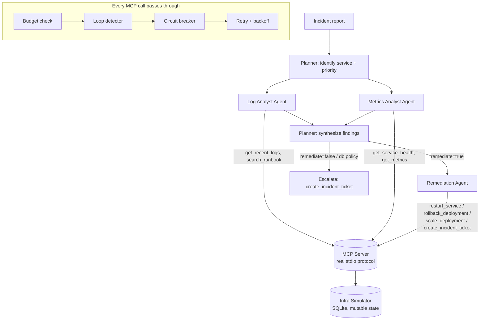

# DevOps Triage Agent

A multi-agent incident-triage system: a **planner** delegates to **specialist
agents** (log analysis, metrics analysis, remediation), all of them calling
tools through a **real MCP server** — not mocked function calls — with an
explicit **reliability layer** (retry with backoff, circuit breaker, loop
detection, run budgets) sitting between every agent and every tool call.

It runs two ways:

- **With `ANTHROPIC_API_KEY` set** — every agent reasons with real Claude
  (`claude-sonnet-4-6`) over the Anthropic Messages API's native tool use,
  calling real MCP tools.
- **Without a key** — a small deterministic "offline playbook" per agent
  drives the exact same orchestration, reliability stack, and MCP server,
  so the whole system is runnable and testable with zero setup.

```bash
pip install -r requirements.txt
python3 main.py --scenario crashloop            # dry-run (default, safe)
python3 main.py --scenario crashloop --confirm-actions   # actually remediate
python3 main.py --scenario latency --flake-rate 0.6       # stress the retry logic
python3 -m pytest tests/ -v
```

Scenarios available: `crashloop` (OOM/CrashLoopBackOff), `latency` (bad
canary deploy), `db` (connection pool exhaustion — deliberately the one
case where policy forbids automated remediation, see below).

---

## Why this exists

Most "agent demo" projects either (a) call one tool through one hop with no
failure handling, or (b) fake multi-agent behavior with string-matched
prompts and no real tool protocol underneath. This project is built to show
the parts of agentic engineering that actually matter in production:

1. **A real MCP server**, not a mocked tool dispatcher. Any MCP client —
   Claude Desktop, another framework, this project's own client — can
   launch `src/mcp_server.py` and call these tools over the real stdio
   protocol.
2. **Least-privilege tool access per agent**, enforced in code. The Log
   Analyst physically cannot call `restart_service`; the allow-list check
   happens in `BaseAgent.run()`, not just in a system prompt the model
   could ignore or hallucinate past.
3. **A dedicated reliability layer** (`src/reliability.py`) that is
   independently unit-tested with zero LLM/network dependency: exponential
   backoff with jitter, a per-tool circuit breaker, a loop detector that
   catches both exact-repeat and oscillating tool-call patterns, and a
   hard budget on iterations / tool calls / wall-clock time.
4. **An explicit, conservative escalation policy** — not "the agent decided
   to give up," but a named, testable rule: DB connection exhaustion always
   escalates to a human regardless of confidence, because runbook policy
   says restart/rollback don't fix it and could be disruptive. See
   `test_db_scenario_escalates_instead_of_auto_remediating`.
5. **A dry-run safety rail by default.** Remediation actions do not mutate
   real state unless you pass `--confirm-actions`; every dry run still
   flows through the full reasoning chain so you can see exactly what the
   system *would* have done.
6. **Full structured tracing.** Every agent start/stop, LLM decision, tool
   call, retry, circuit trip, loop detection, and handoff between agents is
   written to `traces/<run_id>.jsonl` — the artifact you'd hand an SRE
   after an incident, or a reviewer, to answer "what did it actually do."

## Architecture



**Control flow** (`src/orchestrator.py`):

1. **Plan** — Planner reads the raw incident text, identifies the target
   service.
2. **Investigate (concurrent)** — Log Analyst and Metrics Analyst run via
   `asyncio.gather`, sharing one `ReliableMCPClient` connection, so their
   tool calls genuinely interleave through the same circuit breaker and
   loop detector state — this is where a naive implementation would let one
   agent's retries starve the other.
3. **Synthesize** — Planner combines both findings and applies policy:
   escalate if confidence is low, if the two specialists disagree, or if
   the category is `db` (policy-mandated human review).
4. **Remediate (conditional)** — Remediation Agent takes exactly one
   category-appropriate action (`restart_service` for crashloops,
   `rollback_deployment` for bad deploys), and escalates via
   `create_incident_ticket` rather than trying a second remediation blind —
   see the "one attempt, then escalate" rule in
   `src/agents/remediation_agent.py`.

## The reliability layer, in detail

| Concern | Where | Behavior |
|---|---|---|
| Transient tool failure | `RetryPolicy` | Up to 3 attempts, exponential backoff + jitter, capped delay. `TerminalError` (e.g. unknown service) skips retry entirely. |
| Persistently broken tool | `CircuitBreaker` | Per-tool state machine (closed → open → half-open). Opens after N consecutive failures; a half-open trial call either recloses or reopens the circuit. One tool tripping never affects another tool's breaker. |
| Agent stuck in a loop | `LoopDetector` | Hashes `(tool, args)`; raises on 3+ identical consecutive calls *or* a short oscillating cycle (A, B, A, B, A, B). This is the #1 real-world failure mode of ReAct-style agents and is the thing most demo projects skip entirely. |
| Runaway resource use | `Budget` | Hard ceiling on iterations, tool calls, and wall-clock time — shared across the whole run, not just per agent, so five well-behaved agents can't collectively blow the budget. |

All four are exercised by pure unit tests with **no LLM and no
subprocess** (`tests/test_reliability.py`, 16 tests), and again by
**integration tests against the real MCP server subprocess**
(`tests/test_orchestrator.py`, 5 tests) — including a test that cranks
simulated infra flakiness to 95% and asserts the run still reaches a clean
terminal state instead of hanging.

Run the failure modes yourself:

```bash
# Force retries and watch the circuit breaker trip on restart_service:
python3 main.py --scenario crashloop --flake-rate 0.9 --confirm-actions
```

## Project layout

```
src/
  reliability.py        Retry, circuit breaker, loop detector, budget (no deps on anything else)
  tracing.py             Structured JSONL tracer + human-readable stderr echo
  infra_simulator.py      Stateful fake infra (SQLite) backing the MCP tools
  mcp_server.py            Real MCP server (FastMCP, stdio) exposing 10 DevOps tools
  mcp_client.py             Reliability-wrapped MCP client used by every agent
  llm_client.py              AnthropicLLM (real) + OfflineLLM (deterministic fallback)
  orchestrator.py             Planner-led control flow, concurrent specialist dispatch
  agents/
    base_agent.py              Shared tool-calling loop, least-privilege enforcement
    planner_agent.py            Plan + synthesize
    log_analyst_agent.py         Logs + runbook search
    metrics_analyst_agent.py      Health + metrics
    remediation_agent.py          One bounded remediation attempt, then escalate
main.py                  CLI entry point
tests/
  test_reliability.py     Pure unit tests, no LLM/network
  test_orchestrator.py     Integration tests, real MCP subprocess, offline LLM
```

## What would change to point this at real infrastructure

Only `src/infra_simulator.py` is a stand-in. The MCP tool surface in
`src/mcp_server.py` is written the way you'd write it against real
backends — swap the simulator calls for a `kubernetes` client,
`prometheus-api-client`, and a PagerDuty/Opsgenie SDK, and the rest of the
system (agents, reliability layer, orchestrator, tracing) is unchanged.
That boundary is deliberate: it's the difference between a toy and
something you could actually productionize.

## Known simplifications (said out loud, not hidden)

- The offline playbooks are intentionally simple pattern-matching, not real
  reasoning — they exist so the system is gradeable without an API key.
  Set `ANTHROPIC_API_KEY` to see the same orchestration driven by an actual
  model.
- The infra simulator's fault model is simplified (three scripted fault
  types) rather than a general-purpose chaos engine.
- Circuit breaker / loop detector / budget state currently lives in-process
  for the duration of one CLI run; a persistent version (e.g. Redis-backed)
  would be the natural next step for a long-running service.
